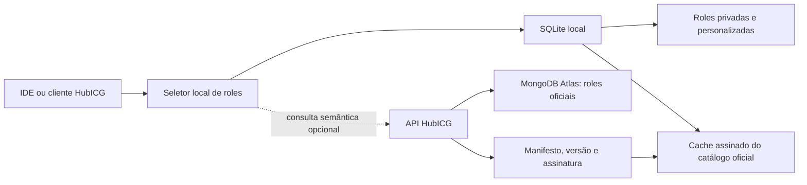

# Estudo de armazenamento, manutenção e seleção de roles

**Estado:** recomendação aprovada para protótipo local

**Prioridade:** P1 — arquitetura de produto; não bloqueia a sanitização P0

**Data:** 07/08/2026

## 1. Decisão recomendada

Adotar uma arquitetura híbrida e local-first:

- **roles personalizadas, preferências e cache:** SQLite no dispositivo;
- **roles padrão e oficiais:** MongoDB Atlas, isolado atrás de uma API HubICG;
- **seleção local:** filtros determinísticos e busca textual, usando FTS5 quando
  disponível e uma busca compatível de contingência quando não estiver;
- **seleção semântica remota:** opcional, pela API, com Atlas Vector Search;
- **privacidade:** clientes nunca recebem credenciais do Atlas e prompts/chats
  não são enviados nem persistidos no catálogo por padrão.

Essa separação permite operação offline, baixa complexidade de instalação e
controle local das roles privadas, sem perder a curadoria e a atualização
centralizadas do catálogo oficial.

## 2. Requisitos considerados

- instalação leve em Linux, macOS, Windows e IDEs;
- funcionamento offline e ausência de servidor local obrigatório;
- transações e migrações de schema;
- busca por nome, idioma, tag, capacidade e texto;
- composição auditável de uma ou mais roles;
- versionamento, origem, integridade e revogação de roles oficiais;
- isolamento entre catálogo público, dados da pessoa e dados da organização;
- independência de provedor e modelo de IA;
- evolução futura para ranking semântico sem tornar a rede obrigatória.

## 3. Comparação das alternativas locais

| Alternativa | Adequação | Pontos fortes | Limites para este caso |
|---|---|---|---|
| SQLite | **Recomendada** | Embarcada, transacional, arquivo único, sem servidor e disponível na biblioteca padrão do Python | Uma escrita por vez; requer desenho explícito do schema e migrações |
| JSON em diretórios | Somente como formato de intercâmbio | Legível, versionável e simples para contribuições | Busca, concorrência, índices, migrações e consistência ficam a cargo da aplicação |
| DuckDB | Secundária, para análise | Embarcada e excelente para consultas analíticas | É orientada a OLAP, não ao armazenamento operacional primário das roles |
| MongoDB local | Não recomendada para o cliente básico | Modelo documental semelhante ao catálogo remoto | Serviço e operação locais aumentam peso, superfície de segurança e suporte multiplataforma |

O SQLite é adequado a armazenamento local de aplicações, é serverless e
zero-configuration, usa um único arquivo e oferece transações ACID. Sua
limitação de um escritor por vez é aceitável para um catálogo local operado por
uma instância do HubICG. Fontes: [SQLite — About](https://sqlite.org/about.html)
e [SQLite — Appropriate Uses](https://www.sqlite.org/whentouse.html).

O FTS5 oferece busca textual e ranking BM25, mas sua presença depende da
compilação da biblioteca; por isso o HubICG deve detectar a capacidade e manter
um fallback determinístico. Fonte: [SQLite FTS5](https://sqlite.org/fts5.html).
O Python fornece acesso SQLite por sua biblioteca padrão, sem dependência de
runtime adicional. Fonte: [Python `sqlite3`](https://docs.python.org/3/library/sqlite3.html).

O DuckDB é mantido como opção futura para análises agregadas, não como fonte
operacional, pois seu foco declarado é carga analítica/OLAP. Fonte:
[DuckDB — Why DuckDB](https://duckdb.org/why_duckdb).

## 4. Arquitetura híbrida



### 4.1 Banco local

O arquivo padrão será `.hubicg/state/roles.db`, ignorado pelo Git. O schema
inicial contém:

- `roles`: conteúdo, origem, idioma, versão e SHA-256;
- `role_tags`: classificação muitos-para-muitos;
- `catalog_state`: revisão e hash do último catálogo oficial sincronizado;
- `schema_metadata`: versão das migrações;
- `roles_fts`: índice opcional FTS5.

Origens aceitas:

- `custom`: privada, criada pela pessoa ou organização local;
- `project`: role versionada no projeto;
- `official`: cópia verificada do catálogo mantido pela HubTech.

### 4.2 Catálogo oficial e API

Os clientes não devem conectar diretamente ao Atlas. A API guarda as
credenciais, aplica autorização, limites, versionamento e políticas de
distribuição. O backend pode usar o driver oficial do MongoDB; a conta técnica
deve ter somente os privilégios necessários. Fontes: [PyMongo](https://www.mongodb.com/docs/languages/python/pymongo-driver/current/get-started/),
[conexão de drivers ao Atlas](https://www.mongodb.com/docs/atlas/driver-connection/)
e [usuários de banco do Atlas](https://www.mongodb.com/docs/atlas/security-add-mongodb-users/).

Não usar a antiga Atlas Data API/App Services como base do produto: Data API,
HTTPS Endpoints e componentes relacionados chegaram ao fim de vida em
30/09/2025. Fonte: [Atlas App Services Admin API](https://www.mongodb.com/docs/api/doc/atlas-app-services-admin-api-v3/).

Contrato HTTP inicial proposto:

| Método e rota | Uso |
|---|---|
| `GET /v1/catalogs/official/manifest` | Revisão, schema, hashes e assinatura |
| `GET /v1/roles/{id}/versions/{version}` | Obter versão imutável de uma role |
| `POST /v1/roles/search` | Busca por metadados ou semântica opcional |
| `POST /v1/catalogs/official/sync` | Obter delta desde uma revisão conhecida |
| `GET /v1/revocations` | Invalidar versão comprometida ou retirada |

Cada resposta oficial deve conter `catalogRevision`, `schemaVersion`,
`roleVersion`, `contentHash`, `issuedAt` e uma assinatura verificável. O cache
local só promove uma revisão depois de validar o manifesto inteiro.

## 5. Seleção e composição de roles

O seletor deve trabalhar em estágios auditáveis:

1. extrair intenção, idioma, domínio, risco e capacidades requeridas;
2. aplicar filtros explícitos de compatibilidade e política;
3. buscar candidatos locais por identificador, tags e texto;
4. opcionalmente solicitar ranking semântico remoto usando somente uma intenção
   normalizada e minimizada;
5. pontuar versão, confiança da origem, aderência e preferências autorizadas;
6. detectar instruções incompatíveis antes de compor múltiplas roles;
7. registrar apenas IDs, versões, hashes, regras aplicadas e justificativa da
   escolha — nunca o conteúdo privado do chat por padrão.

Ordem inicial de precedência:

```text
guardrails obrigatórios
  > políticas do ambiente/organização
  > configuração do projeto
  > role personalizada autorizada
  > role oficial
  > comportamento básico
```

O Atlas Vector Search pode apoiar busca semântica e híbrida no catálogo
oficial, inclusive com filtros, mas não deve ser requisito para a experiência
local. Fonte: [MongoDB Vector Search](https://www.mongodb.com/docs/vector-search/).

## 6. Privacidade e titularidade dos dados

- roles `custom` e preferências ficam locais por padrão;
- a sincronização do catálogo oficial é unidirecional e não lê o banco privado;
- telemetria, adaptação por histórico e envio de intenção exigem opt-in separado;
- a API recebe o mínimo necessário e não deve aceitar histórico bruto como
  parâmetro de busca;
- bancos corporativos precisam de isolamento por tenant, retenção definida e
  trilha de acesso;
- backup e exportação local devem ser criptografáveis pelo implementador;
- exclusão do banco local deve ser uma ação explícita e independente do cache.

## 7. Implementação iniciada nesta entrega

- repositório SQLite com schema v1 e consultas parametrizadas;
- comandos `hubicg roles db init`, `hubicg roles db import` e
  `hubicg roles search`;
- FTS5 detectado em execução com fallback local;
- diretório de estado excluído do Git;
- nenhuma conexão remota ou credencial incorporada.

## 8. Próximas decisões e incrementos

1. definir autenticação da API e isolamento de organizações;
2. escolher algoritmo e custódia das chaves de assinatura do catálogo;
3. versionar o schema público da role e regras de compatibilidade;
4. definir pesos e explicabilidade do seletor, com corpus de avaliação
   multilíngue;
5. implementar sync incremental, revogação e rollback do cache;
6. testar concorrência entre IDEs e bloqueio do arquivo SQLite;
7. prototipar Vector Search apenas com dados oficiais, sem prompts privados;
8. submeter o tratamento de histórico/telemetria a revisão jurídica e de
   privacidade antes de qualquer implementação.
