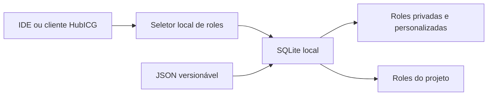

# Estudo de armazenamento, manutenção e seleção de roles

**Estado:** SQLite local aprovado para protótipo; alternativas remotas em estudo

**Prioridade:** P1 somente para armazenamento e seleção locais

**MongoDB Atlas:** estudo exploratório, sem prioridade e sem decisão de adoção

**Data:** 07/08/2026

## 1. Decisão implementada e limite do estudo

Adotar uma arquitetura local-first nesta etapa:

- **roles personalizadas, do projeto e preferências:** SQLite no dispositivo;
- **autoria e intercâmbio:** arquivos JSON versionáveis;
- **seleção local:** filtros determinísticos e busca textual, usando FTS5 quando
  disponível e uma busca compatível de contingência quando não estiver;
- **privacidade:** nenhuma conexão remota, credencial, prompt ou chat é
  necessária para manter e selecionar roles.

O armazenamento de um eventual catálogo remoto oficial ainda não foi decidido.
MongoDB Atlas é apenas uma alternativa documentada para pesquisa comparativa;
não integra a arquitetura aprovada, a prioridade P1 nem o escopo de
implementação atual.

## 2. Requisitos considerados

- instalação leve em Linux, macOS, Windows e IDEs;
- funcionamento offline e ausência de servidor local obrigatório;
- transações e migrações de schema;
- busca por nome, idioma, tag, capacidade e texto;
- composição auditável de uma ou mais roles;
- versionamento, origem, integridade e revogação de roles oficiais;
- isolamento entre catálogo público, dados da pessoa e dados da organização;
- independência de provedor e modelo de IA;
- evolução futura para ranking semântico sem tornar a rede obrigatória.

## 3. Comparação das alternativas locais

| Alternativa | Adequação | Pontos fortes | Limites para este caso |
|---|---|---|---|
| SQLite | **Recomendada** | Embarcada, transacional, arquivo único, sem servidor e disponível na biblioteca padrão do Python | Uma escrita por vez; requer desenho explícito do schema e migrações |
| JSON em diretórios | Somente como formato de intercâmbio | Legível, versionável e simples para contribuições | Busca, concorrência, índices, migrações e consistência ficam a cargo da aplicação |
| DuckDB | Secundária, para análise | Embarcada e excelente para consultas analíticas | É orientada a OLAP, não ao armazenamento operacional primário das roles |
| MongoDB local | Não recomendada para o cliente básico | Modelo documental semelhante ao catálogo remoto | Serviço e operação locais aumentam peso, superfície de segurança e suporte multiplataforma |

O SQLite é adequado a armazenamento local de aplicações, é serverless e
zero-configuration, usa um único arquivo e oferece transações ACID. Sua
limitação de um escritor por vez é aceitável para um catálogo local operado por
uma instância do HubICG. Fontes: [SQLite — About](https://sqlite.org/about.html)
e [SQLite — Appropriate Uses](https://www.sqlite.org/whentouse.html).

O FTS5 oferece busca textual e ranking BM25, mas sua presença depende da
compilação da biblioteca; por isso o HubICG deve detectar a capacidade e manter
um fallback determinístico. Fonte: [SQLite FTS5](https://sqlite.org/fts5.html).
O Python fornece acesso SQLite por sua biblioteca padrão, sem dependência de
runtime adicional. Fonte: [Python `sqlite3`](https://docs.python.org/3/library/sqlite3.html).

O DuckDB é mantido como opção futura para análises agregadas, não como fonte
operacional, pois seu foco declarado é carga analítica/OLAP. Fonte:
[DuckDB — Why DuckDB](https://duckdb.org/why_duckdb).

## 4. Arquitetura priorizada: local



### 4.1 Banco local

O arquivo padrão será `.hubicg/state/roles.db`, ignorado pelo Git. O schema
inicial contém:

- `roles`: conteúdo, origem, idioma, versão e SHA-256;
- `role_tags`: classificação muitos-para-muitos;
- `catalog_state`: estrutura reservada, sem sincronização remota implementada;
- `schema_metadata`: versão das migrações;
- `roles_fts`: índice opcional FTS5.

Origens aceitas:

- `custom`: privada, criada pela pessoa ou organização local;
- `project`: role versionada no projeto;
- `official`: origem reservada para uma futura fonte oficial, ainda não
  selecionada.

### 4.2 Estudo remoto sem prioridade

Um catálogo oficial remoto poderá ser estudado futuramente. As alternativas
incluem distribuição de artefatos assinados, API com banco relacional, API com
banco documental ou repositórios Git versionados. Não há opção escolhida nem
prazo de implementação.

MongoDB Atlas permanece apenas como uma das hipóteses. Se vier a ser avaliado
por protótipo separado, o cliente não deverá conectar diretamente ao banco; uma
API deverá isolar credenciais, autorização e limites. Fontes úteis para o
estudo: [PyMongo](https://www.mongodb.com/docs/languages/python/pymongo-driver/current/get-started/),
[conexão de drivers ao Atlas](https://www.mongodb.com/docs/atlas/driver-connection/)
e [usuários de banco do Atlas](https://www.mongodb.com/docs/atlas/security-add-mongodb-users/).

Não usar a antiga Atlas Data API/App Services como base do produto: Data API,
HTTPS Endpoints e componentes relacionados chegaram ao fim de vida em
30/09/2025. Fonte: [Atlas App Services Admin API](https://www.mongodb.com/docs/api/doc/atlas-app-services-admin-api-v3/).

As rotas abaixo são somente perguntas de desenho para uma eventual comparação
de APIs; não constituem contrato aprovado nem backlog priorizado:

| Método e rota | Uso |
|---|---|
| `GET /v1/catalogs/official/manifest` | Revisão, schema, hashes e assinatura |
| `GET /v1/roles/{id}/versions/{version}` | Obter versão imutável de uma role |
| `POST /v1/roles/search` | Busca por metadados ou semântica opcional |
| `POST /v1/catalogs/official/sync` | Obter delta desde uma revisão conhecida |
| `GET /v1/revocations` | Invalidar versão comprometida ou retirada |

Qualquer alternativa futura deverá avaliar revisão de catálogo, versão de
schema, hashes, assinatura, revogação, operação offline, custo, privacidade e
portabilidade antes de ser submetida a decisão arquitetural.

## 5. Seleção e composição de roles

O seletor deve trabalhar em estágios auditáveis:

1. extrair intenção, idioma, domínio, risco e capacidades requeridas;
2. aplicar filtros explícitos de compatibilidade e política;
3. buscar candidatos locais por identificador, tags e texto;
4. pontuar versão, confiança da origem, aderência e preferências autorizadas;
5. detectar instruções incompatíveis antes de compor múltiplas roles;
6. registrar apenas IDs, versões, hashes, regras aplicadas e justificativa da
   escolha — nunca o conteúdo privado do chat por padrão.

Ordem inicial de precedência:

```text
guardrails obrigatórios
  > políticas do ambiente/organização
  > configuração do projeto
  > role personalizada autorizada
  > role oficial
  > comportamento básico
```

Como item exclusivamente exploratório, o Atlas Vector Search possui recursos
de busca semântica e híbrida que poderiam ser comparados com outras opções em
um estudo futuro. Isso não representa escolha, prioridade ou requisito do
HubICG. Fonte: [MongoDB Vector Search](https://www.mongodb.com/docs/vector-search/).

## 6. Privacidade e titularidade dos dados

- roles `custom` e preferências ficam locais por padrão;
- não existe sincronização remota na implementação atual;
- telemetria, adaptação por histórico e eventual envio de intenção exigem
  decisão e opt-in separados;
- qualquer API futura deverá receber o mínimo necessário e não aceitar
  histórico bruto como parâmetro de busca;
- bancos corporativos precisam de isolamento por tenant, retenção definida e
  trilha de acesso;
- backup e exportação local devem ser criptografáveis pelo implementador;
- exclusão do banco local deve ser uma ação explícita e independente do cache.

## 7. Implementação iniciada nesta entrega

- repositório SQLite com schema v1 e consultas parametrizadas;
- comandos `hubicg roles db init`, `hubicg roles db import` e
  `hubicg roles search`;
- FTS5 detectado em execução com fallback local;
- schema público e validação compatível entre arquivos e banco;
- seleção determinística com normalização de caixa/acentos, filtros, motivos,
  precedência de origem e conflitos declarados;
- backup com integridade, exportação determinística e restauração aprovada;
- diretório de estado excluído do Git;
- nenhuma conexão remota ou credencial incorporada.

## 8. Próximos incrementos priorizados

1. ampliar o corpus multilíngue e calibrar pesos do seletor com evidência;
2. testar concorrência prolongada entre múltiplas IDEs;
3. criar a primeira migração somente quando houver schema v2 real;
4. submeter o tratamento de histórico/telemetria a revisão jurídica e de
   privacidade antes de qualquer implementação.

## 9. Pesquisa sem prioridade

Sem compromisso de execução, um estudo futuro poderá comparar MongoDB Atlas
com outras formas de distribuir um catálogo oficial. A comparação deverá ser
apresentada para decisão específica antes de gerar ADR, API, infraestrutura,
credenciais, protótipo remoto ou backlog de implementação.
